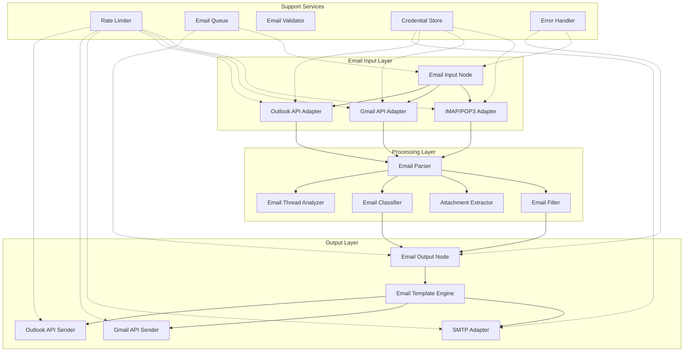
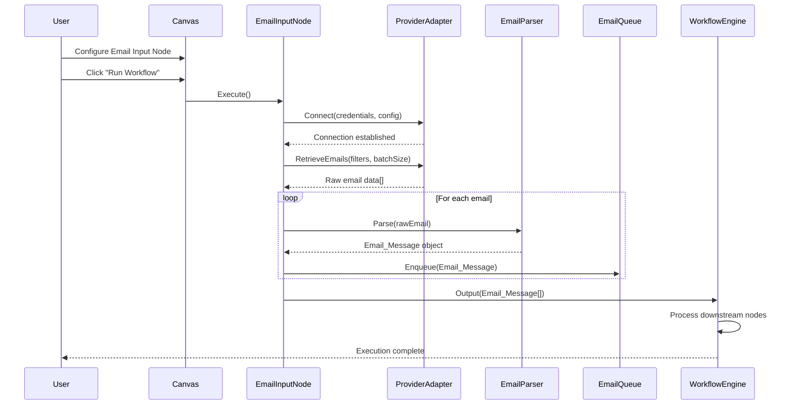
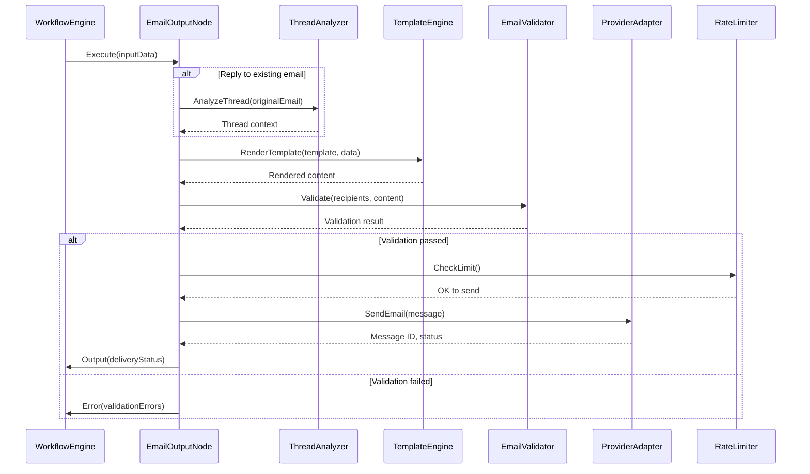
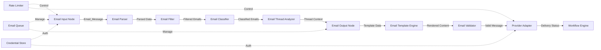

# Design Document: Email Processing Nodes

## Overview

### Purpose

Email Processing Nodes là một hệ thống các node chuyên biệt được thiết kế để xử lý email input/output trong Office Automation Platform. Hệ thống này cung cấp khả năng đọc email từ nhiều nguồn khác nhau (IMAP/POP3, Gmail API, Outlook API), phân tích và xử lý nội dung email, và gửi email với nội dung được tạo động từ workflow.

### Core Functionality

**Logic Đọc Email (Email Reading Logic):**

Hệ thống đọc email hoạt động theo mô hình pipeline với các bước sau:

1. **Connection & Authentication**: Thiết lập kết nối bảo mật với email provider thông qua IMAP/POP3 hoặc OAuth2 (Gmail/Outlook API)
2. **Email Retrieval**: Lấy danh sách email dựa trên filter criteria (folder, date range, unread status, sender, subject)
3. **Batch Processing**: Xử lý email theo batch để tối ưu hiệu suất và tránh quá tải
4. **Parsing & Extraction**: Phân tích cấu trúc MIME, trích xuất headers, body (HTML/plain text), và attachments
5. **Data Transformation**: Chuyển đổi raw email data thành Email_Message objects chuẩn hóa
6. **Queue Management**: Đưa email vào queue để xử lý tuần tự hoặc song song

**Logic Trả Lời Email (Email Reply Logic):**

Hệ thống trả lời email hoạt động theo flow sau:

1. **Context Analysis**: Phân tích email gốc để trích xuất thread context, recipients, subject
2. **Template Rendering**: Sử dụng Email_Template_Engine để tạo nội dung reply từ template với dynamic data
3. **Thread Preservation**: Duy trì thread continuity bằng cách set References và In-Reply-To headers
4. **Content Construction**: Xây dựng MIME message với proper encoding, multipart structure (text + HTML)
5. **Attachment Handling**: Đính kèm files nếu cần
6. **Delivery**: Gửi email qua SMTP hoặc provider API với rate limiting và retry logic
7. **Status Tracking**: Ghi nhận delivery status và message ID

### Key Design Principles

1. **Provider Abstraction**: Unified interface cho tất cả email providers (IMAP, Gmail, Outlook) để workflow code không phụ thuộc vào provider cụ thể
2. **Async Processing**: Tất cả email operations đều async để không block workflow execution
3. **Error Resilience**: Comprehensive error handling với retry logic, fallback strategies, và detailed error reporting
4. **Security First**: Encryption cho credentials, secure connections (SSL/TLS), và data privacy compliance
5. **Rate Limit Compliance**: Automatic rate limiting để tuân thủ provider API limits
6. **Scalability**: Batch processing và queue management để xử lý large volumes

## Architecture

### High-Level Architecture



### Email Reading Workflow



### Email Reply Workflow



### Component Interaction Flow



## Components and Interfaces

### 1. Email Input Node

**Responsibility**: Đọc email từ email providers và output Email_Message objects

**Interface**:
```typescript
interface EmailInputNode extends Node {
  config: EmailInputConfig;
  execute(): Promise<EmailMessage[]>;
  connect(): Promise<void>;
  disconnect(): Promise<void>;
}

interface EmailInputConfig {
  provider: 'imap' | 'pop3' | 'gmail' | 'outlook';
  credentials: EmailCredentials;
  filters: EmailFilters;
  batchSize: number;
  markAsRead: boolean;
}

interface EmailFilters {
  folder?: string;
  unreadOnly?: boolean;
  dateRange?: { start: Date; end: Date };
  sender?: string | RegExp;
  subject?: string | RegExp;
  hasAttachment?: boolean;
  labels?: string[]; // Gmail specific
  categories?: string[]; // Outlook specific
}
```

**Key Methods**:
- `execute()`: Main execution method that retrieves emails
- `connect()`: Establishes connection to email provider
- `disconnect()`: Closes connection
- `applyFilters()`: Applies filter criteria to email retrieval
- `batchRetrieve()`: Retrieves emails in batches

### 2. Provider Adapters

**Responsibility**: Abstract provider-specific implementations

**Interface**:
```typescript
interface EmailProviderAdapter {
  connect(credentials: EmailCredentials): Promise<void>;
  disconnect(): Promise<void>;
  retrieveEmails(filters: EmailFilters, limit: number): Promise<RawEmail[]>;
  sendEmail(message: EmailMessage): Promise<SendResult>;
  getRateLimits(): RateLimitInfo;
}

// IMAP/POP3 Adapter
class IMAPAdapter implements EmailProviderAdapter {
  private connection: IMAPConnection;
  private config: IMAPConfig;
  
  async connect(credentials: EmailCredentials): Promise<void> {
    // Establish IMAP connection with SSL/TLS
  }
  
  async retrieveEmails(filters: EmailFilters, limit: number): Promise<RawEmail[]> {
    // Fetch emails using IMAP commands
    // SEARCH, FETCH with proper flags
  }
}

// Gmail API Adapter
class GmailAdapter implements EmailProviderAdapter {
  private oauth2Client: OAuth2Client;
  private gmail: gmail_v1.Gmail;
  
  async connect(credentials: EmailCredentials): Promise<void> {
    // OAuth2 authentication flow
    // Token refresh handling
  }
  
  async retrieveEmails(filters: EmailFilters, limit: number): Promise<RawEmail[]> {
    // Use Gmail API messages.list with query
    // Handle pagination
  }
}

// Outlook API Adapter
class OutlookAdapter implements EmailProviderAdapter {
  private msalClient: ConfidentialClientApplication;
  private graphClient: Client;
  
  async connect(credentials: EmailCredentials): Promise<void> {
    // Microsoft Graph OAuth2 authentication
  }
  
  async retrieveEmails(filters: EmailFilters, limit: number): Promise<RawEmail[]> {
    // Use Microsoft Graph /me/messages endpoint
    // Handle $filter, $search, $top, $skip
  }
}
```

### 3. Email Parser

**Responsibility**: Parse raw email data into structured Email_Message objects

**Interface**:
```typescript
interface EmailParser extends Node {
  parse(rawEmail: RawEmail): Promise<EmailMessage>;
  parseHeaders(rawHeaders: string): EmailHeaders;
  parseBody(rawBody: string, contentType: string): EmailBody;
  parseAttachments(rawEmail: RawEmail): Attachment[];
}

class MIMEParser {
  parse(mimeContent: string): ParsedMIME {
    // Parse MIME structure
    // Handle multipart messages
    // Decode content (base64, quoted-printable)
  }
  
  decodeHeader(encodedHeader: string): string {
    // RFC 2047 decoding
  }
  
  extractParts(mimeParts: MIMEPart[]): {
    textPart?: string;
    htmlPart?: string;
    attachments: Attachment[];
  } {
    // Extract text, HTML, and attachments from MIME parts
  }
}
```

### 4. Email Filter Node

**Responsibility**: Filter emails based on criteria

**Interface**:
```typescript
interface EmailFilterNode extends Node {
  config: FilterConfig;
  execute(emails: EmailMessage[]): Promise<FilterResult>;
}

interface FilterConfig {
  criteria: FilterCriteria[];
  logic: 'AND' | 'OR';
  outputUnmatched: boolean;
}

interface FilterCriteria {
  field: 'sender' | 'subject' | 'body' | 'date' | 'attachment' | 'label' | 'category';
  operator: 'equals' | 'contains' | 'matches' | 'before' | 'after' | 'between';
  value: any;
}

interface FilterResult {
  matched: EmailMessage[];
  unmatched: EmailMessage[];
}
```

### 5. Email Output Node

**Responsibility**: Send emails via SMTP or provider APIs

**Interface**:
```typescript
interface EmailOutputNode extends Node {
  config: EmailOutputConfig;
  execute(inputData: any): Promise<SendResult>;
  constructMessage(data: any): Promise<EmailMessage>;
  send(message: EmailMessage): Promise<SendResult>;
}

interface EmailOutputConfig {
  provider: 'smtp' | 'gmail' | 'outlook';
  credentials: EmailCredentials;
  template: EmailTemplate;
  replyTo?: EmailMessage; // For reply functionality
  threadId?: string; // For threading
}

interface EmailTemplate {
  subject: string; // Template with {{variables}}
  body: string; // Template with {{variables}}
  bodyType: 'text' | 'html' | 'both';
  attachments?: AttachmentConfig[];
}
```

### 6. Email Template Engine

**Responsibility**: Render email templates with dynamic data

**Interface**:
```typescript
interface EmailTemplateEngine {
  render(template: string, data: any): string;
  compile(template: string): CompiledTemplate;
  registerHelper(name: string, fn: HelperFunction): void;
}

class TemplateEngine implements EmailTemplateEngine {
  render(template: string, data: any): string {
    // Variable substitution: {{variable}}
    // Conditionals: {{#if condition}}...{{/if}}
    // Loops: {{#each items}}...{{/each}}
    // Helpers: {{formatDate date "YYYY-MM-DD"}}
  }
  
  sanitize(html: string): string {
    // XSS prevention for HTML templates
  }
}
```

### 7. Email Thread Analyzer

**Responsibility**: Analyze email threads and conversation context

**Interface**:
```typescript
interface EmailThreadAnalyzer extends Node {
  analyzeThread(emails: EmailMessage[]): Promise<ThreadAnalysis>;
  reconstructThread(email: EmailMessage): Promise<EmailMessage[]>;
  extractContext(thread: EmailMessage[]): ThreadContext;
}

interface ThreadAnalysis {
  threadId: string;
  messages: EmailMessage[];
  participants: string[];
  initiator: string;
  latestResponder: string;
  messageCount: number;
  threadDuration: number; // milliseconds
  averageResponseTime: number;
  summary?: string; // AI-generated summary
}

interface ThreadContext {
  originalMessage: EmailMessage;
  previousReplies: EmailMessage[];
  quotedText: string[];
  newContent: string;
}
```

### 8. Email Validator

**Responsibility**: Validate email addresses and content

**Interface**:
```typescript
interface EmailValidator {
  validateAddress(email: string): ValidationResult;
  validateAddresses(emails: string[]): ValidationResult[];
  validateContent(message: EmailMessage): ValidationResult;
  validateDNS(domain: string): Promise<boolean>;
  validateSMTP(email: string): Promise<boolean>;
}

interface ValidationResult {
  valid: boolean;
  errors: ValidationError[];
}

interface ValidationError {
  field: string;
  code: string;
  message: string;
}
```

### 9. Rate Limiter

**Responsibility**: Enforce rate limits for email operations

**Interface**:
```typescript
interface RateLimiter {
  checkLimit(operation: string, provider: string): Promise<boolean>;
  waitForSlot(operation: string, provider: string): Promise<void>;
  recordOperation(operation: string, provider: string): void;
  getRemainingQuota(provider: string): QuotaInfo;
}

interface QuotaInfo {
  limit: number;
  remaining: number;
  resetTime: Date;
}

class TokenBucketRateLimiter implements RateLimiter {
  private buckets: Map<string, TokenBucket>;
  
  async checkLimit(operation: string, provider: string): Promise<boolean> {
    const key = `${provider}:${operation}`;
    const bucket = this.buckets.get(key);
    return bucket.hasTokens();
  }
  
  async waitForSlot(operation: string, provider: string): Promise<void> {
    // Wait until token is available
    // Implement exponential backoff if needed
  }
}
```

### 10. Email Queue

**Responsibility**: Manage email processing queue

**Interface**:
```typescript
interface EmailQueue {
  enqueue(email: EmailMessage, priority?: number): void;
  dequeue(): EmailMessage | null;
  peek(): EmailMessage | null;
  size(): number;
  clear(): void;
  pause(): void;
  resume(): void;
  getStatus(): QueueStatus;
}

interface QueueStatus {
  total: number;
  processed: number;
  pending: number;
  failed: number;
  paused: boolean;
}

class PriorityEmailQueue implements EmailQueue {
  private queue: PriorityQueue<EmailMessage>;
  private failedQueue: EmailMessage[];
  
  enqueue(email: EmailMessage, priority?: number): void {
    // Add to priority queue
    // Higher priority emails processed first
  }
  
  processBatch(batchSize: number): Promise<ProcessResult[]> {
    // Process multiple emails in parallel
    // Respect concurrency limits
  }
}
```

## Data Models

### Email Message

```typescript
interface EmailMessage {
  id: string;
  provider: 'imap' | 'gmail' | 'outlook';
  headers: EmailHeaders;
  body: EmailBody;
  attachments: Attachment[];
  metadata: EmailMetadata;
  flags: EmailFlags;
}

interface EmailHeaders {
  from: string;
  to: string[];
  cc?: string[];
  bcc?: string[];
  subject: string;
  date: Date;
  messageId: string;
  inReplyTo?: string;
  references?: string[];
  replyTo?: string;
  customHeaders?: Record<string, string>;
}

interface EmailBody {
  text?: string; // Plain text version
  html?: string; // HTML version
  encoding: string;
  charset: string;
}

interface Attachment {
  id: string;
  filename: string;
  contentType: string;
  size: number;
  contentId?: string; // For inline attachments
  content?: Buffer; // Actual content (lazy loaded)
  url?: string; // Reference URL for large attachments
}

interface EmailMetadata {
  // Provider-specific metadata
  threadId?: string; // Gmail, Outlook
  labels?: string[]; // Gmail
  categories?: string[]; // Outlook
  importance?: 'low' | 'normal' | 'high'; // Outlook
  snippet?: string; // Gmail
  
  // Processing metadata
  receivedAt: Date;
  processedAt?: Date;
  classification?: Classification;
  validationResult?: ValidationResult;
}

interface EmailFlags {
  seen: boolean;
  flagged: boolean;
  answered: boolean;
  draft: boolean;
  deleted: boolean;
}

interface Classification {
  categories: string[];
  confidence: Record<string, number>;
  method: 'rule-based' | 'ai-based';
}
```

### Email Credentials

```typescript
interface EmailCredentials {
  type: 'password' | 'oauth2';
  data: PasswordCredentials | OAuth2Credentials;
}

interface PasswordCredentials {
  username: string;
  password: string; // Encrypted
  server: string;
  port: number;
  secure: boolean; // SSL/TLS
}

interface OAuth2Credentials {
  clientId: string;
  clientSecret: string; // Encrypted
  accessToken: string; // Encrypted
  refreshToken: string; // Encrypted
  expiresAt: Date;
  scopes: string[];
}
```

### Send Result

```typescript
interface SendResult {
  success: boolean;
  messageId?: string;
  threadId?: string;
  timestamp: Date;
  provider: string;
  error?: {
    code: string;
    message: string;
    retryable: boolean;
  };
}
```

### Raw Email

```typescript
interface RawEmail {
  uid: number | string;
  source: string; // Raw MIME content
  flags: string[];
  internalDate: Date;
  size: number;
}
```

## Correctness Properties

*A property is a characteristic or behavior that should hold true across all valid executions of a system—essentially, a formal statement about what the system should do. Properties serve as the bridge between human-readable specifications and machine-verifiable correctness guarantees.*

Before defining correctness properties, I need to analyze the acceptance criteria to determine which are suitable for property-based testing.


### Property Reflection

After analyzing all acceptance criteria, I've identified the following properties suitable for property-based testing. Now I'll perform reflection to eliminate redundancy:

**Identified Properties:**
1. Email filtering (Requirements 1.5, 5.2-5.10) - Multiple filter criteria properties
2. Email parsing completeness (Requirements 4.2, 4.3, 4.5, 4.7, 4.9) - Multiple extraction properties
3. Email parsing round-trip (Requirement 4.10) - Explicit round-trip property
4. Template rendering (Requirements 10.2-10.9) - Multiple template engine properties
5. Email validation (Requirements 13.2, 13.5-13.9) - Multiple validation properties
6. Batch processing (Requirements 1.7, 2.10) - Batch completeness properties

**Redundancy Analysis:**

- **Filter Properties (5.2-5.10)**: These can be combined into ONE comprehensive property: "For any filter configuration and email set, filtering produces correct matched/unmatched partition"
- **Parsing Extraction Properties (4.2, 4.3, 4.5, 4.7, 4.9)**: These can be combined into ONE property: "For any valid email, parsing extracts all required fields"
- **Template Properties (10.2, 10.5)**: 10.5 is redundant with 10.2 - both test variable substitution
- **Batch Properties (1.7, 2.10)**: These can be combined into ONE property about batch completeness

**Consolidated Properties:**

After reflection, here are the unique, non-redundant properties:

1. **Email Filter Correctness** (consolidates 5.2-5.10)
2. **Email Parser Completeness** (consolidates 4.2, 4.3, 4.5, 4.7, 4.9)
3. **Email Parsing Round-Trip** (4.10)
4. **Template Variable Substitution** (10.2)
5. **Template Conditional Rendering** (10.3)
6. **Template Loop Rendering** (10.4)
7. **Template Nested Access** (10.6)
8. **Template XSS Sanitization** (10.8)
9. **Template Undefined Fallback** (10.9)
10. **Template Syntax Validation** (10.10)
11. **Email Address Validation** (13.2)
12. **Email Content Validation** (13.5, 13.6, 13.8)
13. **Batch Processing Completeness** (1.7, 2.10)

### Property 1: Email Filter Correctness

*For any* email filter configuration (sender, subject, date, attachment, content, flags, labels) and any set of emails, the Email_Filter_Node SHALL partition emails into matched and unmatched sets such that:
- All emails in matched set satisfy ALL filter criteria (for AND logic) or AT LEAST ONE criterion (for OR logic)
- All emails in unmatched set fail to satisfy the filter criteria
- The union of matched and unmatched sets equals the original email set
- The intersection of matched and unmatched sets is empty

**Validates: Requirements 5.2, 5.3, 5.4, 5.5, 5.6, 5.7, 5.8, 5.9, 5.10**

### Property 2: Email Parser Completeness

*For any* valid raw email with headers, body, and attachments, the Email_Parser SHALL extract and output an Email_Message object containing:
- All standard headers (From, To, Cc, Bcc, Subject, Date, Message-ID, Reply-To)
- Both plain text and HTML body versions (if present in source)
- Complete attachment metadata (filename, content type, size, content ID)
- Email metadata (timestamps, authentication results, priority flags)
- Any custom headers specified in configuration

**Validates: Requirements 4.2, 4.3, 4.5, 4.7, 4.9**

### Property 3: Email Parsing Round-Trip

*For any* valid Email_Message object, the following round-trip SHALL preserve essential data:
1. Serialize Email_Message to MIME format (using Email_Output_Node)
2. Parse the MIME format back to Email_Message (using Email_Parser)
3. The resulting Email_Message SHALL be equivalent to the original in all essential fields (headers, body content, attachment metadata)

**Validates: Requirement 4.10**

### Property 4: Template Variable Substitution

*For any* email template containing variable placeholders {{variable_name}} and any input data object, the Email_Template_Engine SHALL render the template by replacing all variable placeholders with corresponding values from the input data, where:
- Defined variables are replaced with their string representation
- Undefined variables are replaced with empty string or configured fallback value
- Variable names are case-sensitive
- Nested variables using dot notation ({{user.name}}) access nested object properties

**Validates: Requirements 10.2, 10.5, 10.6**

### Property 5: Template Conditional Rendering

*For any* email template containing conditional blocks {{#if condition}}...{{/if}} and any input data, the Email_Template_Engine SHALL:
- Include the conditional block content in output if condition evaluates to truthy value
- Exclude the conditional block content from output if condition evaluates to falsy value
- Support nested conditionals correctly
- Evaluate conditions based on input data values

**Validates: Requirement 10.3**

### Property 6: Template Loop Rendering

*For any* email template containing loop blocks {{#each items}}...{{/each}} and any input data with array properties, the Email_Template_Engine SHALL:
- Render the loop block content once for each item in the array
- Provide access to current item properties within loop block
- Render empty string if array is empty or undefined
- Preserve order of items from input array

**Validates: Requirement 10.4**

### Property 7: Template Helper Functions

*For any* email template using helper functions (formatDate, formatNumber, etc.) and any valid input values, the Email_Template_Engine SHALL apply the helper function and produce correctly formatted output according to the helper's specification.

**Validates: Requirement 10.7**

### Property 8: Template XSS Sanitization

*For any* HTML email template and any user input data containing potential XSS payloads (script tags, event handlers, javascript: URLs), the Email_Template_Engine SHALL sanitize the input by:
- Removing or escaping script tags
- Removing event handler attributes (onclick, onerror, etc.)
- Removing javascript: protocol URLs
- Preserving safe HTML content and formatting

**Validates: Requirement 10.8**

### Property 9: Template Undefined Variable Fallback

*For any* email template containing variable placeholders and any input data where some variables are undefined, the Email_Template_Engine SHALL replace undefined variables with:
- Empty string (default behavior)
- User-configured fallback value (if specified)
- Never throw errors or stop rendering

**Validates: Requirement 10.9**

### Property 10: Template Syntax Validation

*For any* email template string, the Email_Template_Engine SHALL validate template syntax before execution and:
- Return validation success for syntactically correct templates
- Return validation errors with error messages and positions for syntactically incorrect templates (unclosed tags, invalid syntax, unknown helpers)
- Detect errors without executing the template

**Validates: Requirement 10.10**

### Property 11: Email Address Validation

*For any* string input, the Email_Validator SHALL validate email address syntax according to RFC 5322 standard and:
- Return valid=true for syntactically correct email addresses
- Return valid=false with specific error codes for invalid addresses (missing @, invalid characters, invalid domain format)
- Handle edge cases (quoted strings, comments, IP addresses in domain)

**Validates: Requirement 13.2**

### Property 12: Email Content Validation

*For any* email message data (recipients, subject, body, attachments), the Email_Validator SHALL:
- Check all required fields are present and non-empty
- Detect common issues (empty subject, empty body, suspicious links, spam triggers)
- Validate attachments against configured rules (file types, size limits)
- Output validation result with complete list of validation errors including field names and error descriptions

**Validates: Requirements 13.5, 13.6, 13.7, 13.8, 13.9**

### Property 13: Batch Processing Completeness

*For any* set of N emails and any batch size B, the Email_Input_Node SHALL retrieve all N emails across ceil(N/B) batches such that:
- Total emails retrieved equals N
- Each batch contains at most B emails
- Last batch may contain fewer than B emails
- No emails are duplicated across batches
- No emails are skipped

**Validates: Requirements 1.7, 2.10**

### Property 14: Email Metadata Preservation

*For any* email retrieved from any provider (IMAP, Gmail, Outlook), the Email_Input_Node SHALL preserve provider-specific metadata in the Email_Message object:
- Gmail: thread ID, message ID, labels, snippet
- Outlook: conversation ID, importance, categories
- IMAP: UID, flags, internal date

**Validates: Requirements 2.5, 3.5**

### Property 15: Attachment Lazy Loading

*For any* email with attachments, the Email_Input_Node SHALL retrieve attachment metadata (filename, content type, size, content ID) without downloading attachment content by default, and:
- Attachment content is null or undefined in initial Email_Message
- Attachment content can be loaded on-demand when requested
- Large attachments (>10MB) provide reference URL instead of content

**Validates: Requirements 2.9, 6.6**

## Error Handling

### Error Categories

The system handles four main categories of errors:

1. **Connection Errors**: Network failures, authentication failures, server unavailable
2. **Parsing Errors**: Malformed MIME, invalid encoding, corrupted attachments
3. **Validation Errors**: Invalid email addresses, missing required fields, policy violations
4. **Rate Limit Errors**: API quota exceeded, throttling by provider

### Error Handling Strategies

```typescript
interface ErrorHandler {
  handleError(error: EmailError, context: ErrorContext): Promise<ErrorResolution>;
}

interface EmailError {
  category: 'connection' | 'parsing' | 'validation' | 'rate_limit';
  code: string;
  message: string;
  retryable: boolean;
  details?: any;
}

interface ErrorContext {
  node: Node;
  operation: string;
  attempt: number;
  maxAttempts: number;
}

interface ErrorResolution {
  action: 'retry' | 'skip' | 'fail' | 'fallback';
  delay?: number; // milliseconds
  fallbackValue?: any;
}
```

### Retry Logic

**Exponential Backoff Strategy**:
```typescript
class ExponentialBackoff {
  calculateDelay(attempt: number, baseDelay: number = 1000): number {
    return Math.min(baseDelay * Math.pow(2, attempt - 1), 30000); // Max 30 seconds
  }
}

// Example retry flow:
// Attempt 1: Immediate
// Attempt 2: Wait 1 second
// Attempt 3: Wait 2 seconds
// Attempt 4: Fail (max 3 retries)
```

### Error Recovery Patterns

**1. Connection Error Recovery**:
```typescript
async function connectWithRetry(adapter: EmailProviderAdapter, credentials: EmailCredentials): Promise<void> {
  const maxAttempts = 3;
  const backoff = new ExponentialBackoff();
  
  for (let attempt = 1; attempt <= maxAttempts; attempt++) {
    try {
      await adapter.connect(credentials);
      return; // Success
    } catch (error) {
      if (attempt === maxAttempts) {
        throw new ConnectionError('Failed to connect after 3 attempts', error);
      }
      const delay = backoff.calculateDelay(attempt);
      await sleep(delay);
    }
  }
}
```

**2. Parsing Error Recovery**:
```typescript
async function parseWithFallback(parser: EmailParser, rawEmail: RawEmail): Promise<EmailMessage> {
  try {
    return await parser.parse(rawEmail);
  } catch (error) {
    // Log error but return partial data
    logger.error('Email parsing failed', { error, emailId: rawEmail.uid });
    return {
      ...createPartialEmailMessage(rawEmail),
      parsingErrors: [error.message]
    };
  }
}
```

**3. Rate Limit Error Recovery**:
```typescript
async function sendWithRateLimit(sender: EmailProviderAdapter, message: EmailMessage): Promise<SendResult> {
  const rateLimiter = getRateLimiter(sender.provider);
  
  await rateLimiter.waitForSlot('send', sender.provider);
  
  try {
    const result = await sender.sendEmail(message);
    rateLimiter.recordOperation('send', sender.provider);
    return result;
  } catch (error) {
    if (error.code === 'RATE_LIMIT_EXCEEDED') {
      const retryAfter = error.retryAfter || 60000; // Default 60 seconds
      await sleep(retryAfter);
      return sendWithRateLimit(sender, message); // Retry once
    }
    throw error;
  }
}
```

### Error Logging

All errors are logged with structured data for debugging and monitoring:

```typescript
interface ErrorLog {
  timestamp: Date;
  nodeId: string;
  nodeName: string;
  operation: string;
  errorCategory: string;
  errorCode: string;
  errorMessage: string;
  stackTrace?: string;
  context: {
    workflowId: string;
    executionId: string;
    userId: string;
    provider?: string;
    emailId?: string;
  };
}
```

### User-Facing Error Messages

Errors are translated to user-friendly messages:

```typescript
const ERROR_MESSAGES = {
  'CONNECTION_FAILED': 'Unable to connect to email server. Please check your credentials and server settings.',
  'AUTH_FAILED': 'Authentication failed. Please verify your username and password.',
  'RATE_LIMIT_EXCEEDED': 'Email provider rate limit exceeded. The workflow will automatically retry after a short delay.',
  'PARSING_FAILED': 'Unable to parse email content. The email may be corrupted or in an unsupported format.',
  'VALIDATION_FAILED': 'Email validation failed. Please check recipient addresses and email content.',
  'ATTACHMENT_TOO_LARGE': 'Attachment size exceeds the maximum limit. Please use smaller files.',
};
```

## Testing Strategy

### Testing Approach

The Email Processing Nodes feature requires a **dual testing approach**:

1. **Property-Based Tests**: Verify universal properties across all inputs (15 properties defined above)
2. **Unit Tests**: Verify specific examples, edge cases, and error conditions
3. **Integration Tests**: Verify connections to external email providers

### Property-Based Testing

**Library Selection**: Use **fast-check** (for TypeScript/JavaScript) for property-based testing

**Configuration**:
- Minimum 100 iterations per property test
- Each test tagged with feature name and property number
- Tag format: `Feature: email-processing-nodes, Property {number}: {property_text}`

**Example Property Test**:
```typescript
import fc from 'fast-check';

describe('Feature: email-processing-nodes, Property 1: Email Filter Correctness', () => {
  it('should correctly partition emails into matched and unmatched sets', () => {
    fc.assert(
      fc.property(
        fc.array(emailMessageArbitrary()),
        filterConfigArbitrary(),
        (emails, filterConfig) => {
          const filter = new EmailFilterNode(filterConfig);
          const result = filter.execute(emails);
          
          // Property assertions
          const union = [...result.matched, ...result.unmatched];
          const intersection = result.matched.filter(e => result.unmatched.includes(e));
          
          // Union equals original set
          expect(union.length).toBe(emails.length);
          expect(new Set(union.map(e => e.id))).toEqual(new Set(emails.map(e => e.id)));
          
          // Intersection is empty
          expect(intersection.length).toBe(0);
          
          // All matched emails satisfy filter
          result.matched.forEach(email => {
            expect(satisfiesFilter(email, filterConfig)).toBe(true);
          });
          
          // All unmatched emails don't satisfy filter
          result.unmatched.forEach(email => {
            expect(satisfiesFilter(email, filterConfig)).toBe(false);
          });
        }
      ),
      { numRuns: 100 }
    );
  });
});
```

### Unit Testing

**Focus Areas**:
- Specific examples demonstrating correct behavior
- Edge cases (empty inputs, null values, boundary conditions)
- Error conditions (malformed data, connection failures)
- Provider-specific behavior

**Example Unit Tests**:
```typescript
describe('Email Parser', () => {
  it('should parse email with empty body', () => {
    const rawEmail = createRawEmail({ body: '' });
    const parsed = parser.parse(rawEmail);
    expect(parsed.body.text).toBe('');
    expect(parsed.body.html).toBeUndefined();
  });
  
  it('should handle malformed MIME gracefully', () => {
    const malformedEmail = createMalformedEmail();
    const parsed = parser.parse(malformedEmail);
    expect(parsed.parsingErrors).toBeDefined();
    expect(parsed.parsingErrors.length).toBeGreaterThan(0);
  });
  
  it('should extract inline attachments with content ID', () => {
    const emailWithInline = createEmailWithInlineImage();
    const parsed = parser.parse(emailWithInline);
    const inlineAttachment = parsed.attachments.find(a => a.contentId);
    expect(inlineAttachment).toBeDefined();
    expect(inlineAttachment.contentId).toMatch(/^<.*>$/);
  });
});
```

### Integration Testing

**Focus Areas**:
- Actual connections to email providers (using test accounts)
- OAuth2 flows (Gmail, Outlook)
- SMTP/IMAP protocol compliance
- Rate limiting behavior with real APIs

**Test Environment**:
- Use dedicated test email accounts for each provider
- Mock external services for CI/CD pipeline
- Use real services for manual/staging testing

**Example Integration Tests**:
```typescript
describe('Gmail Integration', () => {
  let gmailAdapter: GmailAdapter;
  
  beforeAll(async () => {
    gmailAdapter = new GmailAdapter();
    await gmailAdapter.connect(testCredentials.gmail);
  });
  
  it('should retrieve emails from Gmail inbox', async () => {
    const emails = await gmailAdapter.retrieveEmails({ folder: 'INBOX' }, 10);
    expect(emails.length).toBeGreaterThan(0);
    expect(emails[0]).toHaveProperty('threadId');
    expect(emails[0]).toHaveProperty('labels');
  });
  
  it('should handle Gmail rate limits gracefully', async () => {
    // Send many requests to trigger rate limit
    const promises = Array(300).fill(null).map(() => 
      gmailAdapter.retrieveEmails({ folder: 'INBOX' }, 1)
    );
    
    // Should not throw, should handle rate limiting internally
    await expect(Promise.all(promises)).resolves.toBeDefined();
  });
});
```

### Test Coverage Goals

- **Property-Based Tests**: 100% coverage of defined properties (15 properties)
- **Unit Tests**: 80%+ code coverage for core logic
- **Integration Tests**: Coverage of all provider adapters and critical paths

### Continuous Testing

- Run property-based tests on every commit (100 iterations)
- Run full test suite (1000 iterations for PBT) nightly
- Run integration tests on staging environment before production deployment

## Security Considerations

### 1. Credential Security

**Encryption at Rest**:
```typescript
class CredentialStore {
  private encryptionKey: Buffer;
  
  async storeCredentials(userId: string, credentials: EmailCredentials): Promise<void> {
    const encrypted = await this.encrypt(JSON.stringify(credentials));
    await database.save({
      userId,
      credentials: encrypted,
      algorithm: 'AES-256-GCM'
    });
  }
  
  private async encrypt(data: string): Promise<string> {
    const iv = crypto.randomBytes(16);
    const cipher = crypto.createCipheriv('aes-256-gcm', this.encryptionKey, iv);
    const encrypted = Buffer.concat([cipher.update(data, 'utf8'), cipher.final()]);
    const authTag = cipher.getAuthTag();
    return Buffer.concat([iv, authTag, encrypted]).toString('base64');
  }
}
```

**OAuth2 Token Management**:
- Store access tokens and refresh tokens encrypted
- Automatic token refresh before expiration
- Revoke tokens on user logout or account deletion
- Use secure token storage (not localStorage)

### 2. Connection Security

**SSL/TLS Enforcement**:
```typescript
const imapConfig = {
  host: 'imap.gmail.com',
  port: 993,
  secure: true, // Use SSL/TLS
  tls: {
    rejectUnauthorized: true, // Reject invalid certificates
    minVersion: 'TLSv1.2' // Minimum TLS version
  }
};
```

**Certificate Validation**:
- Always validate SSL/TLS certificates
- Reject self-signed certificates in production
- Pin certificates for known providers (optional)

### 3. Data Privacy

**Email Content Handling**:
```typescript
class EmailProcessor {
  async processEmail(email: EmailMessage): Promise<void> {
    // Process in memory, don't persist by default
    const result = await this.workflow.execute(email);
    
    // Only persist if explicitly configured
    if (this.config.persistEmails) {
      await this.storage.save(email, {
        encryption: true,
        retention: this.config.retentionDays
      });
    }
  }
}
```

**Sensitive Data Redaction**:
```typescript
class SensitiveDataRedactor {
  redact(text: string): string {
    return text
      .replace(/\b\d{3}-\d{2}-\d{4}\b/g, '***-**-****') // SSN
      .replace(/\b\d{4}[\s-]?\d{4}[\s-]?\d{4}[\s-]?\d{4}\b/g, '****-****-****-****') // Credit card
      .replace(/\b[A-Za-z0-9._%+-]+@[A-Za-z0-9.-]+\.[A-Z|a-z]{2,}\b/g, '***@***.***'); // Email (in logs)
  }
}
```

### 4. Access Control

**Role-Based Access Control (RBAC)**:
```typescript
enum Permission {
  READ_EMAILS = 'read:emails',
  SEND_EMAILS = 'send:emails',
  CONFIGURE_NODES = 'configure:nodes',
  MANAGE_CREDENTIALS = 'manage:credentials'
}

class AccessControl {
  async checkPermission(userId: string, permission: Permission): Promise<boolean> {
    const userRoles = await this.getUserRoles(userId);
    return userRoles.some(role => role.permissions.includes(permission));
  }
}
```

**Audit Logging**:
```typescript
interface AuditLog {
  timestamp: Date;
  userId: string;
  action: 'read' | 'send' | 'delete' | 'configure';
  resource: string; // email ID, node ID, etc.
  result: 'success' | 'failure';
  ipAddress: string;
  userAgent: string;
}

class AuditLogger {
  async log(entry: AuditLog): Promise<void> {
    await database.auditLogs.insert(entry);
    
    // Alert on suspicious activity
    if (this.isSuspicious(entry)) {
      await this.alertSecurityTeam(entry);
    }
  }
}
```

### 5. Input Validation

**Email Address Validation**:
- Validate against RFC 5322 standard
- Check for injection attempts
- Limit recipient count to prevent abuse

**Content Sanitization**:
- Sanitize HTML content to prevent XSS
- Validate attachment file types
- Scan attachments for malware (optional integration)

### 6. Rate Limiting

**Per-User Rate Limits**:
```typescript
class UserRateLimiter {
  private limits = {
    emailsPerHour: 1000,
    emailsPerDay: 10000,
    attachmentSizePerDay: 1024 * 1024 * 1024 // 1GB
  };
  
  async checkUserLimit(userId: string, operation: string): Promise<boolean> {
    const usage = await this.getUserUsage(userId);
    return usage[operation] < this.limits[operation];
  }
}
```

### 7. Compliance

**GDPR Compliance**:
- Data retention policies (auto-delete after configured period)
- Right to erasure (delete all user data on request)
- Data portability (export user data)
- Consent management for email processing

**Data Residency**:
- Store data in user-specified regions
- Comply with local data protection laws

## Performance Optimization

### 1. Batch Processing

Process emails in batches to optimize throughput:
```typescript
const BATCH_SIZE = 50;
const CONCURRENCY_LIMIT = 5;

async function processBatch(emails: EmailMessage[]): Promise<void> {
  for (let i = 0; i < emails.length; i += BATCH_SIZE) {
    const batch = emails.slice(i, i + BATCH_SIZE);
    await Promise.all(
      batch.map(email => processEmail(email))
    ).catch(handleBatchError);
  }
}
```

### 2. Lazy Loading

Load attachment content only when needed:
```typescript
class LazyAttachment implements Attachment {
  private _content?: Buffer;
  
  async getContent(): Promise<Buffer> {
    if (!this._content) {
      this._content = await this.provider.downloadAttachment(this.id);
    }
    return this._content;
  }
}
```

### 3. Caching

Cache frequently accessed data:
```typescript
class EmailCache {
  private cache = new LRUCache<string, EmailMessage>({ max: 1000 });
  
  async getEmail(id: string): Promise<EmailMessage> {
    const cached = this.cache.get(id);
    if (cached) return cached;
    
    const email = await this.provider.retrieveEmail(id);
    this.cache.set(id, email);
    return email;
  }
}
```

### 4. Connection Pooling

Reuse connections to email servers:
```typescript
class ConnectionPool {
  private pool: IMAPConnection[] = [];
  private maxSize = 10;
  
  async getConnection(): Promise<IMAPConnection> {
    if (this.pool.length > 0) {
      return this.pool.pop()!;
    }
    return await this.createConnection();
  }
  
  releaseConnection(conn: IMAPConnection): void {
    if (this.pool.length < this.maxSize) {
      this.pool.push(conn);
    } else {
      conn.close();
    }
  }
}
```

## Deployment Considerations

### Environment Variables

```bash
# Email Provider Credentials (encrypted in production)
GMAIL_CLIENT_ID=xxx
GMAIL_CLIENT_SECRET=xxx
OUTLOOK_CLIENT_ID=xxx
OUTLOOK_CLIENT_SECRET=xxx

# SMTP Configuration
SMTP_HOST=smtp.gmail.com
SMTP_PORT=587
SMTP_SECURE=true

# Rate Limiting
RATE_LIMIT_EMAILS_PER_MINUTE=10
RATE_LIMIT_EMAILS_PER_HOUR=1000

# Security
ENCRYPTION_KEY=xxx
JWT_SECRET=xxx

# Performance
BATCH_SIZE=50
CONCURRENCY_LIMIT=5
CONNECTION_POOL_SIZE=10

# Data Retention
EMAIL_RETENTION_DAYS=30
LOG_RETENTION_DAYS=90
```

### Monitoring and Alerts

**Key Metrics to Monitor**:
- Email processing rate (emails/minute)
- Error rate by category
- API quota usage by provider
- Average processing time per email
- Queue depth and processing lag
- Connection pool utilization

**Alert Conditions**:
- Error rate > 5%
- API quota > 80% used
- Processing lag > 5 minutes
- Connection failures > 3 in 10 minutes

### Scalability

**Horizontal Scaling**:
- Stateless node design allows multiple instances
- Use distributed queue (Redis, RabbitMQ) for email queue
- Load balance across multiple workers

**Vertical Scaling**:
- Increase batch size for higher throughput
- Increase concurrency limit for parallel processing
- Increase connection pool size for better resource utilization

## Future Enhancements

1. **AI-Powered Features**:
   - Smart email classification using ML models
   - Automatic response generation
   - Sentiment analysis
   - Priority detection

2. **Advanced Filtering**:
   - Natural language query for email filtering
   - Saved filter templates
   - Filter performance analytics

3. **Collaboration Features**:
   - Shared email processing workflows
   - Team inbox management
   - Assignment and routing rules

4. **Enhanced Security**:
   - End-to-end encryption (S/MIME, PGP)
   - Advanced threat detection
   - Phishing detection
   - Malware scanning for attachments

5. **Additional Providers**:
   - Exchange Server
   - Yahoo Mail
   - ProtonMail
   - Custom IMAP/SMTP providers

6. **Performance Improvements**:
   - Streaming processing for large emails
   - Incremental parsing
   - Predictive prefetching
   - Smart caching strategies

---

## Summary

This design document provides a comprehensive technical architecture for Email Processing Nodes, with detailed explanations of:

1. **Logic Đọc Email**: Multi-provider support (IMAP/POP3, Gmail API, Outlook API) with unified interface, batch processing, and queue management
2. **Logic Trả Lời Email**: Template-based email generation with thread preservation, MIME construction, and delivery tracking
3. **Architecture**: Layered design with provider adapters, processing nodes, and support services
4. **Components**: 10 major components with detailed interfaces and implementations
5. **Data Models**: Comprehensive data structures for emails, credentials, and results
6. **Correctness Properties**: 15 properties for property-based testing
7. **Error Handling**: Comprehensive error recovery with retry logic and fallback strategies
8. **Security**: Encryption, access control, audit logging, and compliance
9. **Testing**: Dual approach with property-based tests and unit/integration tests
10. **Performance**: Optimization strategies for batch processing, caching, and connection pooling

The design ensures scalability, security, and reliability while providing a flexible foundation for email automation workflows.
